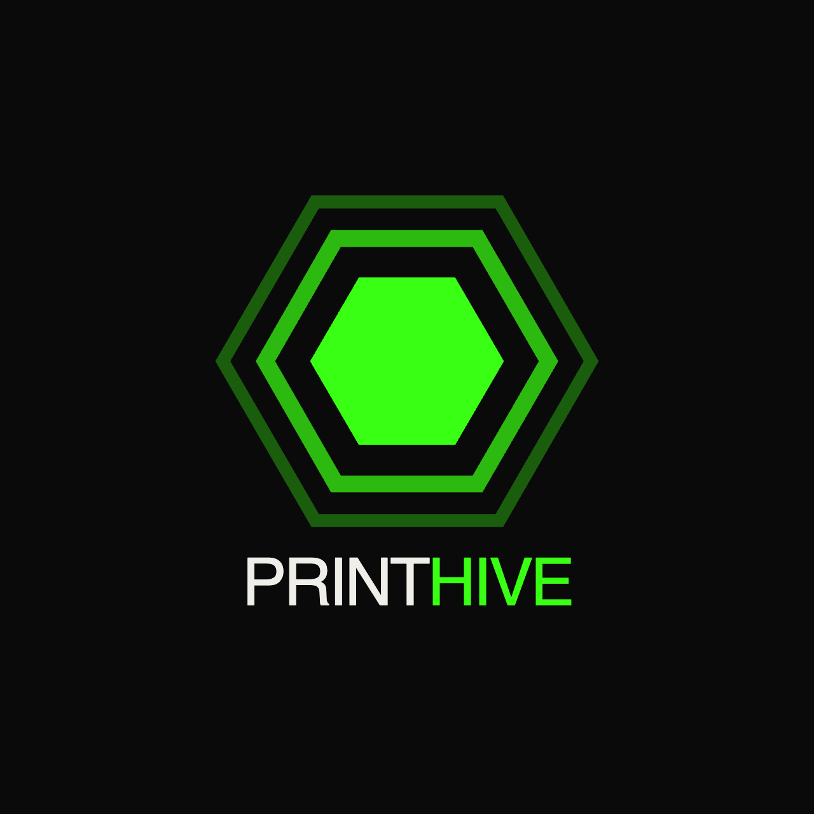

# Print Hive plugins



Official Print Hive plugins for Claude Code, Codex, Cursor, and Grok Bot. Connect an agent to your organization-scoped Print Hive fleet, models, files, materials, inventory, Makes, print jobs, and guarded printer controls through OAuth.

## Cursor / Grok Bot

Install from the Cursor Marketplace (after publish):

1. Open Cursor Settings → Plugins → Marketplace
2. Search for "Print Hive"
3. Click Install, then complete Print Hive OAuth authorization

Until the marketplace listing is published, install locally for **Cursor IDE** (Grok Bot cannot load `~/.cursor/plugins/local`):

```sh
git clone https://github.com/PrintHive/print-hive-plugins
cp -R print-hive-plugins/plugins/print-hive ~/.cursor/plugins/local/print-hive
```

Confirm `plugins/print-hive/mcp.json` is URL-only HTTP to `https://api.printhiv3d.com/v1/mcp` with no API key and no secret env vars.

Or import the repository marketplace in team settings.

## Claude Code

```sh
claude plugin marketplace add PrintHive/print-hive-plugins
claude plugin install print-hive@print-hive --scope user
```

Start Claude Code, open `/mcp`, and complete Print Hive authorization.

## Codex

```sh
codex plugin marketplace add PrintHive/print-hive-plugins
codex plugin add print-hive@print-hive
```

Start a new Codex thread and complete Print Hive authorization when prompted.

## ChatGPT

The reviewed public ChatGPT/Codex listing uses the same MCP server:

```text
https://api.printhiv3d.com/v1/mcp
```

Until the directory listing is approved, add it as a custom MCP connector using OAuth discovery.

## Farm crew (agents)

Second marketplace plugin: `print-hive-farm-crew` — Foreman, Trendy, Spool, Nest, Wrench, Counter.

Install alongside `print-hive` for MCP + role agents. Farm-safe gate: queue/slice when asked; confirm buys, parts, start/stop, and g-code.

## Skills

The plugin includes specialized operator workflow skills:

- **Core:** setup, fleet-operations, library-inventory, grok-claim
- **Operator workflows:** fleet-status, shift-and-dispatch, material-runway, production-commitments, smart-assign, risk-readiness, performance-reporting, reliability-diagnostics, operator-context, filament-operations, briefing-settings

See `plugins/print-hive/skills/` for detailed routing and tool usage.

## Safety

- Every request is bound to the authenticated Print Hive organization.
- OAuth grants are separated by printers, models, jobs, inventory, Makes, fleet, and telemetry domains.
- Production mutations require exact targets and may require explicit confirmation.
- Dangerous printer operations are not implicitly granted to public OAuth clients.
- Printer credentials are entered only in the Print Hive web application.

Read the [documentation](https://printhiv3d.com/mcp), [privacy policy](https://printhiv3d.com/privacy), [terms](https://printhiv3d.com/terms), or [contact support](https://printhiv3d.com/support).
